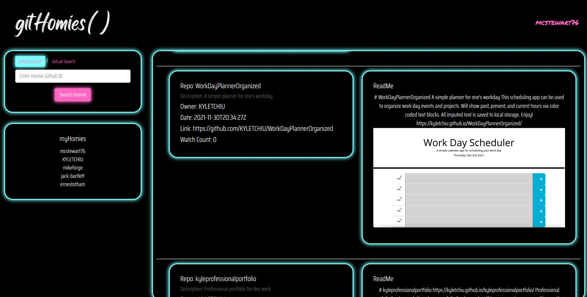

# gitHomies
A user provided that they wanted a social media collaboration tool for developers to share their works.

 Features include:
* Automatically pulls project collaborators from gitHub profile and displays them
* Unique session authentication
* Search and add gitHub and gitLab user accounts
* Profile page that populates gitHub information  

## gitHomies

[Check it out here!](gh.gitHomies.com)

>**Picture of the site**

